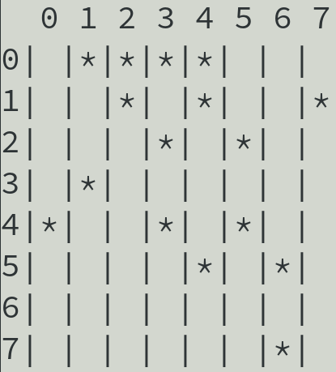
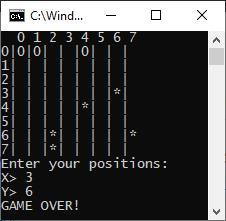

# MinesweeperCLI

Simple **minesweeper** game developed using **C++** in the **CLI** mode.

## About Game

Minesweeper is a single-player puzzle video game. The objective of the game is to clear a rectangular board containing hidden "mines" or bombs without detonating any of them, with help from clues about the number of neighboring mines in each field. The game originates from the 1960s, and has been written for many computing platforms in use today. It has many variations and offshoots.

The player is initially presented with a grid of undifferentiated squares. Some randomly selected squares, unknown to the player, are designated to contain mines. Typically, the size of the grid and the number of mines are set in advance by the user, either by entering the numbers or selecting from defined skill levels, depending on the implementations. (In the Microsoft variant, this is limited to 30 times 24 with 667 mines.)

The game is played by revealing squares of the grid by clicking or otherwise indicating each square. If a square containing a mine is revealed, the player loses the game. If no mine is revealed, a digit is instead displayed in the square, indicating how many adjacent squares contain mines; if no mines are adjacent, the square becomes blank, and all adjacent squares will be recursively revealed. The player uses this information to deduce the contents of other squares, and may either safely reveal each square or mark the square as containing a mine.

In some versions, a question mark may be placed in an unrevealed square to serve as an aid to logical deduction. Implementations may also allow players to quickly "clear around" a revealed square once the correct number of mines have been flagged around it. The game is won when all mine-free squares are revealed, because all mines have been located.

Some versions of Minesweeper will set up the board by never placing a mine on the first square revealed. Minesweeper for versions of Windows protects the first square revealed; from Windows 7 onward, players may elect to replay a board, in which case the first square may no longer be protected.

[Read more!](https://en.wikipedia.org/wiki/Minesweeper_(video_game))

## Similar Projects

- https://www.google.com/search?q=Minesweeper&oq=Minesweeper
- http://minesweeperonline.com/
- http://www.freeminesweeper.org/minecore.html
- https://www.coolmathgames.com/0-minesweeper
- https://minesweeper.online/en/
- https://cardgames.io/minesweeper/
- http://birrell.org/andrew/minesweeper/expert.php
- http://www.chezpoor.com/minesweeper/minecore.html
- http://play-minesweeper.com/
